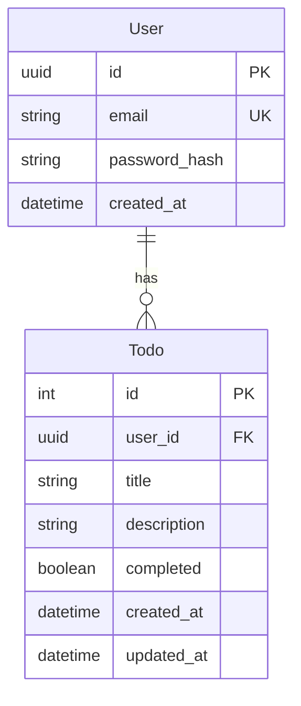

# Data Model: Todo Backend API

## Entity Relationship Diagram

## Schema Definitions (SQLModel)

### User
| Field | Type | Attributes | Description |
|-------|------|------------|-------------|
| id | UUID | Primary Key, Defaults to uuid4 | Unique user identifier |
| email | String | Unique, Index | User's email address |
| password_hash | String | Required | Hashed password (bcrypt) |
| created_at | DateTime | Default to now() | Timestamp of registration |

### Todo
| Field | Type | Attributes | Description |
|-------|------|------------|-------------|
| id | Integer | Primary Key, Auto-increment | Unique task identifier |
| user_id | UUID | Foreign Key (User.id), Index | Owner of the task |
| title | String | Required | Task title |
| description | String | Optional, Nullable | Detailed description |
| completed | Boolean | Default False | Task completion status |
| created_at | DateTime | Default to now() | Creation timestamp |
| updated_at | DateTime | Default to now(), On Update now() | Last update timestamp |

## Validation Rules

1. **Email**: Must be a valid email format.
2. **Title**: Must not be empty, max length 100 chars.
3. **Description**: Max length 500 chars.
4. **Password**: Min length 8 chars (enforced at service level, strictly hashed in DB).
